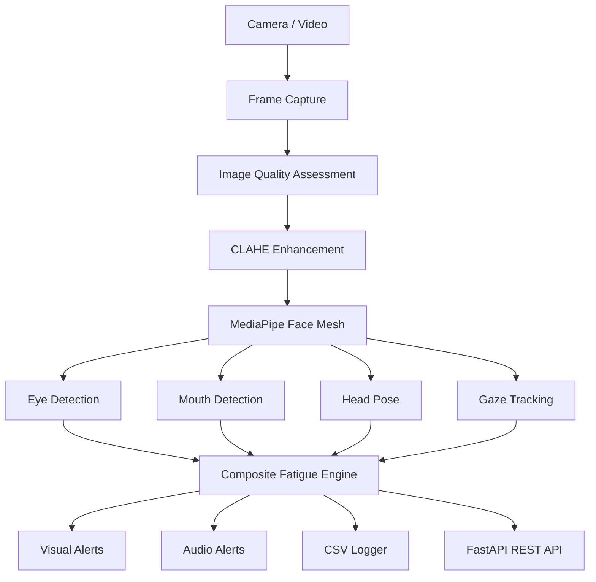

<div align="center">

# 🧠 Neuro-Drive

### Human-Centric Driver Monitoring System using Computer Vision & AI

Real-time AI-powered driver fatigue and distraction detection using **MediaPipe Face Mesh**, **OpenCV**, **FastAPI**, and a multi-factor composite fatigue scoring engine.

<p>


</p>

</div>

---

# 📖 Overview

Neuro-Drive is a **real-time Driver Monitoring System (DMS)** designed to detect **fatigue**, **drowsiness**, **driver distraction**, **head pose deviation**, **yawning**, and **off-road gaze** using only a standard webcam.

The system combines multiple computer vision techniques into a **single composite fatigue model**, making detection significantly more reliable than relying on a single metric such as eye closure.

Unlike traditional academic implementations, Neuro-Drive incorporates:

- Adaptive thresholding
- Per-user calibration
- Composite fatigue scoring
- Environmental robustness
- REST API for dashboards
- Real-time streaming
- CSV analytics logging
- Docker deployment

making it suitable for both research and production-oriented demonstrations.

---

# ✨ Features

| Feature | Description |
|----------|-------------|
| 👁 Eye Aspect Ratio (EAR) | Detects eye closure and prolonged drowsiness |
| 😮 Mouth Aspect Ratio (MAR) | Detects yawning events |
| 🧭 Head Pose Estimation | Detects distraction using solvePnP |
| 👀 Iris Tracking | Detects gaze direction and off-road attention |
| 📊 Composite Fatigue Engine | Combines multiple signals into a single fatigue score |
| 🌙 Adaptive Low-Light Detection | CLAHE enhancement and dynamic thresholds |
| 👤 User Calibration | Learns baseline EAR & gaze automatically |
| ⚡ FastAPI Backend | REST API + Server-Sent Events |
| 📈 CSV Analytics | Session logging and post-drive analysis |
| 🔊 Audio Alerts | Configurable fatigue warnings |
| 🐳 Docker Ready | Easy deployment on any system |

---

# 🚗 Detection Capabilities

| Driver Condition | Detection Technique | Alert |
|-----------------|---------------------|-------|
| Eye Closure | EAR + PERCLOS | ⚠ DROWSY |
| Fatigue | Composite Fatigue Score | 🚨 CRITICAL |
| Yawning | MAR | ⚠ YAWNING |
| Head Turn | Head Pose Estimation | ⚠ DISTRACTED |
| Looking Away | Iris Tracking | ⚠ DISTRACTED |
| No Face Visible | Detection Timeout | ⚠ NO FACE |

---

# 🏗️ System Architecture



---

# 🔄 Detection Pipeline

```mermaid
flowchart LR

Frame

-->

Preprocessing

-->

Face Mesh

-->

Landmark Extraction

Landmark Extraction
-->
EAR

Landmark Extraction
-->
MAR

Landmark Extraction
-->
Head Pose

Landmark Extraction
-->
Gaze Tracking

EAR
-->
Fatigue Engine

MAR
-->
Fatigue Engine

Head Pose
-->
Fatigue Engine

Gaze Tracking
-->
Fatigue Engine

Fatigue Engine
-->
Alert System

Alert System
-->
REST API

Alert System
-->
Dashboard

Alert System
-->
CSV Logs
```

---

# ⚙️ Composite Fatigue Model

Instead of relying on a single metric, Neuro-Drive combines multiple independent indicators into a weighted fatigue score.

```
Fatigue Score

=

0.40 × EAR

+

0.25 × Head Pose

+

0.20 × MAR

+

0.15 × Gaze
```

| Component | Weight | Purpose |
|-----------|--------|----------|
| Eye Closure | 40% | Primary fatigue indicator |
| Head Pose | 25% | Driver distraction |
| Yawning | 20% | Long-term fatigue |
| Gaze Tracking | 15% | Eyes off the road |

The resulting score is smoothed using an **Exponential Moving Average (EMA)** to prevent noisy frame-to-frame fluctuations.

---

# 🧩 High-Level Workflow

```mermaid
flowchart TD

Capture

-->

Frame Enhancement

-->

Face Detection

-->

Landmark Extraction

-->

EAR

-->

MAR

-->

Head Pose

-->

Gaze Tracking

-->

Fatigue Engine

-->

Alert Generation

-->

Dashboard/API

-->
Driver Feedback
```

---

# 📂 Project Structure

```text
neuro-drive/

├── main.py
├── config.py
├── fatigue_detection.py
├── head_pose.py
├── gaze_tracking.py
├── utils.py
├── api.py
├── tests.py
├── requirements.txt
├── Dockerfile
├── README.md
│
├── logs/
│     ├── neuro_drive_events.log
│     └── neuro_drive_data.csv
│
├── docs/
│     ├── screenshots/
│     ├── architecture.png
│     └── demo.gif
│
└── assets/
      └── logo.png
```

---

# 🧠 Detection Algorithms

Neuro-Drive consists of four independent computer vision modules.

1. Eye Aspect Ratio (EAR)
2. Mouth Aspect Ratio (MAR)
3. Head Pose Estimation
4. Iris-Based Gaze Tracking

Each module contributes to the final fatigue score, increasing robustness compared to single-feature detection systems.

---
